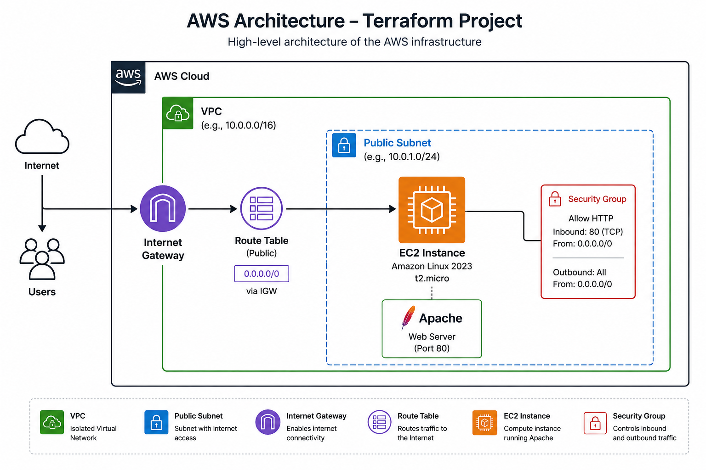

# AWS Terraform Infrastructure

A hands-on AWS Cloud Infrastructure Automation project using Terraform and GitHub Actions. This project provisions a secure and reusable AWS environment and demonstrates Infrastructure as Code (IaC), networking, compute, security, and CI/CD automation.

## Project Overview

This project uses Terraform to automate the provisioning of AWS infrastructure for an Apache web server running on Amazon EC2.

The infrastructure includes:

- AWS VPC
- Public Subnet
- Internet Gateway
- Public Route Table
- Route Table Association
- Security Group
- Amazon Linux 2023 EC2 Instance
- Apache HTTP Web Server
- Terraform variables and outputs
- GitHub Actions CI pipeline

## Architecture



Internet
   |
Internet Gateway
...

Internet
   |
Internet Gateway
   |
Public Route Table
   |
Public Subnet
   |
EC2 Instance
   |
Apache Web Server

The EC2 instance is deployed inside a public subnet. The Internet Gateway and route table provide internet connectivity, while the security group allows HTTP traffic on port 80.

## Technologies Used

- AWS
- Terraform
- Amazon EC2
- Amazon VPC
- Amazon Linux 2023
- Apache HTTP Server
- Git
- GitHub
- GitHub Actions
- Infrastructure as Code (IaC)
- CI/CD

## Infrastructure Components

### VPC
Creates an isolated AWS Virtual Private Cloud with DNS support and DNS hostnames enabled.

### Public Subnet
Creates a public subnet inside the VPC and automatically assigns public IP addresses to instances.

### Internet Gateway
Provides internet connectivity to resources inside the public subnet.

### Route Table
Routes internet-bound traffic through the Internet Gateway.

### Security Group
Controls network access to the EC2 instance. HTTP traffic on port 80 is allowed for demonstration purposes.

### EC2 Web Server
Deploys an Amazon Linux 2023 EC2 instance and automatically installs and starts Apache using Terraform user data.

## Infrastructure as Code

Terraform is used to define and manage the AWS infrastructure declaratively.

The project separates configuration into:

- `main.tf` - AWS infrastructure resources
- `variables.tf` - reusable input variables
- `outputs.tf` - infrastructure outputs
- `providers.tf` - AWS and Terraform provider configuration

## CI/CD with GitHub Actions

A GitHub Actions workflow automatically checks Terraform code whenever changes are pushed to the repository.

The CI pipeline performs:

1. Repository checkout
2. Terraform setup
3. Terraform formatting check
4. Terraform initialization
5. Terraform validation

This helps identify formatting or configuration problems before infrastructure changes are deployed.

## Deployment

Initialize Terraform:

```bash
terraform init
